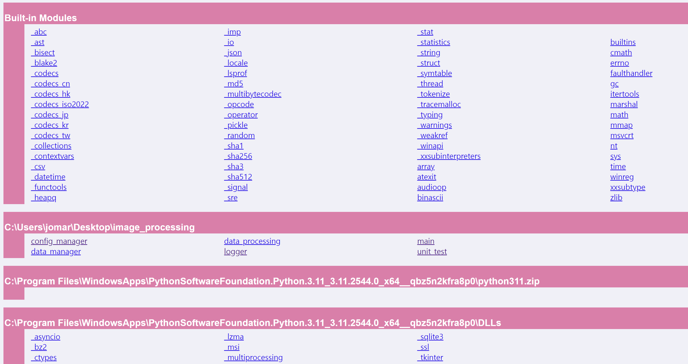

# 목표
3D 포인트 클라우드 데이터 처리 및 2D 투영 시스템 개발  

<br>

## 필요 라이브러리 설치
```bash
pip install pyyaml open3d numpy matplotlib
```
<br>

## Python 버전
Python 3.11.9   


<br>

## 프로젝트 실행 방법
```git
git clone https://github.com/jomartin0730/image_processing.git
```
```bash
cd image_processing
python3 main.py
```
<br>

## 프로젝트 간단 설명
- 3D 데이터 처리 알고리즘 클래스(DataProcessing)
- 3D 데이터 관리 클래스(DataManager)
- 설정 파일 관리 클래스(ConfigFileManager)
- 로거 클래스(Logger)
- 단위 테스트 클래스(TestDataProcessing) <br><br>
- instantiation 순서
1. main 함수를 실행한다. main 함수에서 DataProcessing 인스턴스를 생성한다 ->  
2. DataProcessing 클래스 에서 DataManager 인스턴스를 생성한다 ->   
3. DataManager 클래스 에서 ConfigFileManager 인스턴스를 생성한다 ->
4. ConfigFileManager 클래스 에서 Logger 인스턴스를 생성한다 <br><br>

- 설명
  - main 함수에서 method chaining을 사용하여 YAML 설정 파일의 PCD 또는 PLY 파일 경로와 파라미터 값들을 로드한다.
  - open3d outlier removal 알고리즘을 사용하여 포인트 클라우드의 노이즈를 삭제한다. 알고리즘은 statistical, radius 2가지 사용이 가능하다.
  - 노이즈 제거가 완료된 3D 포인트 클라우드를 투영 백터 값에 따라 투영 후 2D 배열로 변환한다.
  - 투영이 완료된 2D 이미지로 depth map과 heat map을 생성한다. Depth map은 float32 타입, Heat map은 uint8 3channel RGB 타입이다. 해당 프로젝트에서는 빨간색으로 생성했다.
  - 이후 설정 파일에서 지정한 경로에 저장한다.


<br>

## 프로젝트 구조
- 프로젝트 구조
``` 
    📦image_processing
     ┣ 📂config
     ┃ ┗ 📜image.yaml
     ┣ 📂data
     ┃ ┣ 📜sample_data.pcd
     ┃ ┗ 📜sample_data.ply
     ┣ 📂log
     ┃ ┗ 📜total.log
     ┃ ┗ 📜yaml_error.log
     ┣ 📂result
     ┃ ┣ 📜depth_map.png
     ┃ ┗ 📜heat_map.png
     ┣ 📜config_manager.py
     ┣ 📜data_manager.py
     ┣ 📜data_processing.py
     ┣ 📜logger.py
     ┣ 📜main.py
     ┣ 📜README.md
     ┗ 📜unit_test.py
```
- config
  - YAML 설정 파일이 있는 디렉토리
  - image.yaml 파일 안에 이미지 경로, 로그 파일 및 결과 파일 생성 경로, 알고리즘 파라미터 값이 존재
- data
  - 샘플 포인트 클라우드 파일이 있는 디렉토리
  - 단위 테스트에서 생성되는 test용 포인트 클라우드 파일도 존재
- log
  - 로그 파일 저장 디렉토리
  - yaml_error 파일에는 Logger 클래스 인스턴스 생성 전에 발생하는 에러들을 기록(YAML 파일 읽기 실패, YAML 문법 오류 발생)
  - total.log 파일에는 YAML 파일을 정상 적으로 로드한 이후의 작업 내용, 에러 내용 기록
  - 로그 포맷
    - 정상 동작 : 시간 [로그 레벨] 메세지
    - error 경로 추적이 필요한 경우(ex, 다른 메소드에서 호출된 경우) : 시간 [로그 레벨] [클래스 명] [메소드 명] 메세지
    - main에서 error 발생 시 : 시간 [로그 레벨] [__main__] 메세지
- result
  - 정상 동작 후 생성된 depth map과 heat map 2D 이미지 파일 저장 디렉토리
  - 단위 테스트 실행 후 생성되는 test depth map과 heat map 2D 이미지 파일 저장 디렉토리

##  주요 클래스와 함수에 대한 문서 보는 방법
```bash
python -m pydoc -p 3333

>>
Server ready at http://localhost:3333/
Server commands: [b]rowser, [q]uit
server>
```
이런 식으로 웹 서버를 켜고 링크를 따라 들어가 보면(http://localhost:3333/,  
또는 b를 눌러도 된다.)


중간의 C:\Users\jomar\Desktop\image_processing 경로에 있는 파일들을 클릭해서 본다.
